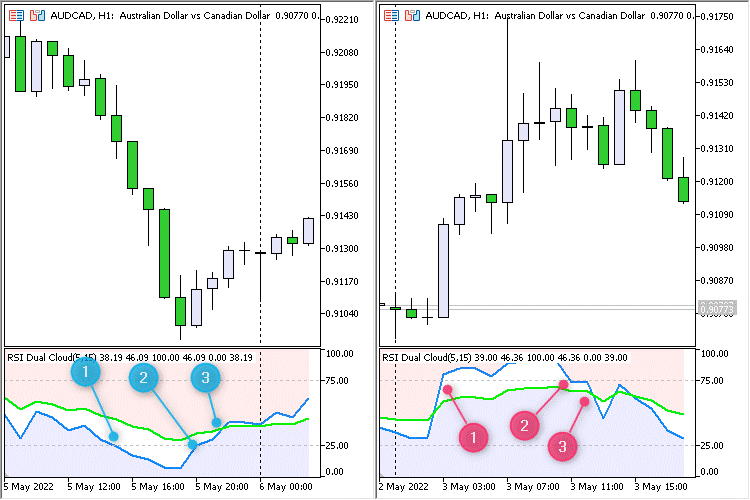

### RSI Dual Cloud EA

An Expert Advisor based on the RSI Dual Cloud indicator.

The trading logic combines several types of RSI signals, including entering a signal zone, staying inside the zone, leaving the zone and crossings between fast and slow RSI lines.

The project demonstrates how multiple indicator events can be combined into a complete automated trading system.

### Screenshot

  

### Links

* [MQL5 CodeBase](https://www.mql5.com/en/code/39497)
* [RSI Dual Cloud Indicator](https://www.mql5.com/en/code/39488)
