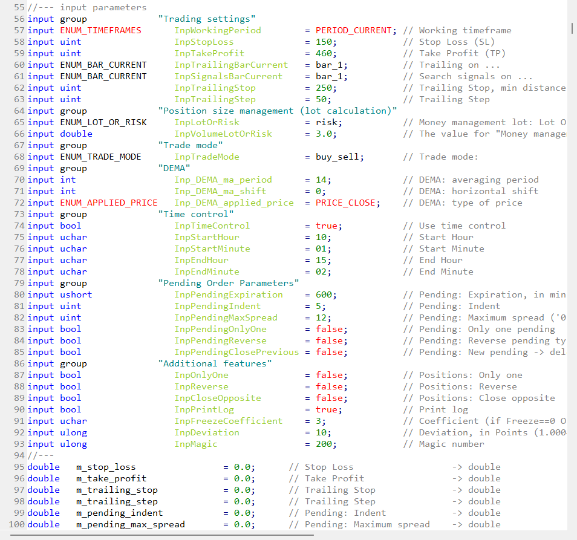

### Trading Engine 4

One of my most important projects.

Trading Engine 4 is a reusable trading framework for MetaTrader 5 that combines many years of experience in developing Expert Advisors and trading utilities.

The project is accompanied by a detailed article explaining the architecture, design decisions and practical usage examples.

### Screenshot

  

### Links

- [MQL5 CodeBase](https://www.mql5.com/ru/code/37813)
- [Article: Trading Engine 4](https://www.mql5.com/en/articles/9717)
