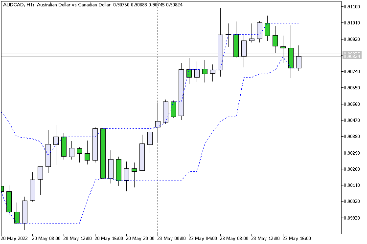

### Channel N Bars

An interpretation of the classic Donchian Channel indicator.

The project demonstrates working with indicator buffers and calculating highest highs and lowest lows over a specified range of bars.

It serves as a practical example of price channel construction and market structure analysis in MQL5.

### Screenshot

  

### Links

* [MQL5 CodeBase](https://www.mql5.com/en/code/39459)
