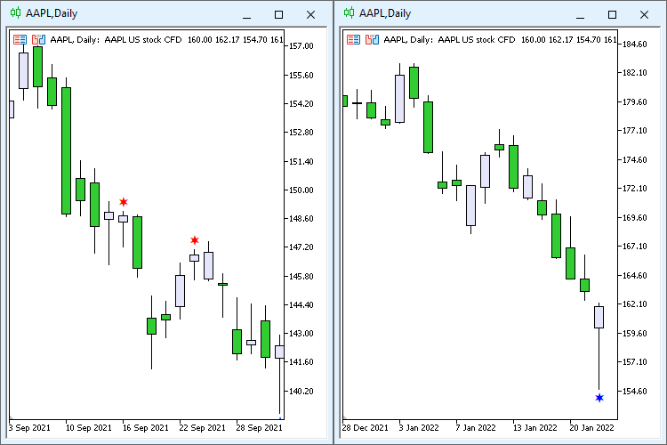

### Hammer and Hanging Man Candlestick

An indicator for detecting the classic Hammer and Hanging Man candlestick patterns.

The project demonstrates candlestick structure analysis using candle body and shadow ratios, as well as pattern classification based on recent market direction.

It serves as a practical example of implementing price action concepts in MQL5.

### Screenshot

  

### Links

* [MQL5 CodeBase](https://www.mql5.com/ru/code/37972)
