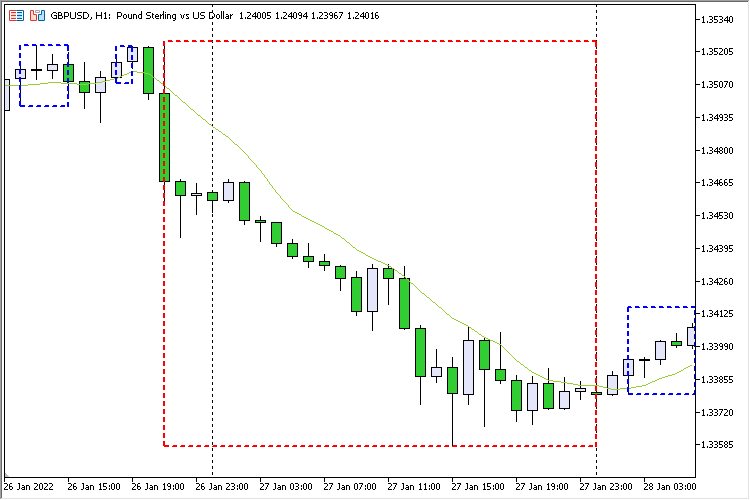

### High Low Cluster

An indicator that identifies clusters between consecutive Moving Average crossings and visualizes them as chart rectangles.

The project demonstrates practical work with indicator handles, custom indicator data processing and graphical chart objects in MQL5.

It can also be used as an example of building dynamic support and resistance zones based on historical price structure.

### Screenshot

  

### Links

* [MQL5 CodeBase](https://www.mql5.com/en/code/39399)
