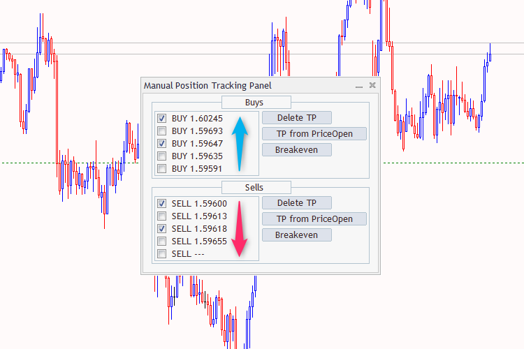
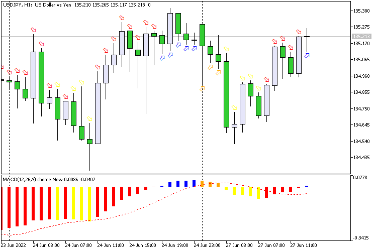

# Portfolio

## Hello!

My name is Vladimir Karputov.

I started developing for MetaTrader more than 13 years ago and have spent most of that time creating tools for traders and developers.

This document is not a complete list of my work. That would be impossible because there are simply too many projects. Instead, this is a brief overview of what I have been building over the years.

My Achievements on the en part of the forum can be viewed here https://www.mql5.com/en/users/barabashkakvn/publications

---

# What I Like to Build

Most of my projects fall into one of these categories:

### Expert Advisors

Automated trading systems based on technical analysis, price action and custom trading logic.

### Indicators

Custom indicators for trend detection, signal generation, market visualization and research.

### Trading Utilities

Small tools that make everyday trading easier.

Examples:

* trade management panels
* position monitoring
* order management
* risk calculation

### Examples

Code intended to help other MQL5 developers learn and build their own projects.

---

# Why So Many Projects?

I have always enjoyed solving practical problems.

Sometimes the result is a large trading system.

Sometimes it is a small utility that saves traders a few minutes every day.

Many of my publications started from questions asked by users on the MQL5 forum:

> "Can this be automated?"
>
> "Can this indicator be improved?"
>
> "Can this be done with MQL5?"

Very often the answer became a new project.

---

# Working With Clients

Freelance development gave me experience with a huge variety of tasks.

No two traders think the same way.

One client needs a scalping robot.

Another needs a risk management tool.

A third wants a completely custom trading workflow.

Building software for so many different users taught me how to turn trading ideas into working applications.

---

# What Interests Me Today

My current interests include:

* algorithmic trading
* quantitative research
* machine learning
* strategy testing
* portfolio analysis
* automation of trading workflows

I am particularly interested in finding ways to combine traditional trading approaches with modern AI tools.

---

# A Note About GitHub

Most of my public work was originally published through the MQL5 CodeBase ecosystem.

For many years that was where MetaTrader developers shared projects, examples and tools.

This GitHub repository is a way to make my work easier to discover outside the MQL5 community.

---

# Thank You

If you came here because of MetaTrader, MQL5, algorithmic trading or open-source development, welcome.

I hope some of the projects in this repository will be useful to you.

# Selected Projects

## Expert Advisors

### RSI Dual Cloud EA
The EA uses a custom indicator 'RSI Dual Cloud'. The EA uses four types of signals:  Entrance to the zone, Being in the zone, Leaving the zone, Lines crossing
https://www.mql5.com/en/code/39497

### Two pending orders 2
At the beginning of the day, an order is issued to delete pending orders that did not work. Then, at a distance of 'Pending: Indent', two opposite (Stop or Limit) pending orders are placed (the type is set in 'Pending Type')
https://www.mql5.com/en/code/39860

## Trading Panels

### Manual Position Tracking Panel
The panel sorts BUY positions in ascending order and SELL positions in price order. The sorted positions are displayed in the panel: a maximum of five BUY and five SELL positions.

  

https://www.mql5.com/en/code/36412

## Close panel
A panel based on class CDialog works for all symbols and magic numbers. It has three buttons based on class CButton
https://www.mql5.com/en/code/23450

## Indicators

### MACD Four Colors Arrow
Continuation of the 'Four Colors' series - now the MACD indicator signals are displayed as 'Arrow' in the main window.

  

https://www.mql5.com/en/code/39821

### Open Interest
The Open Interest indicator shows the parameter "Total volume of open positions - SYMBOL_SESSION_INTEREST".
https://www.mql5.com/en/code/17426
