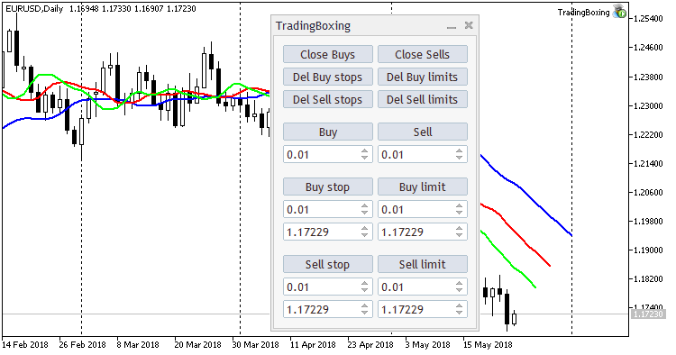

### TradingBoxing

A graphical trading panel for managing positions and pending orders directly from the chart.

The project demonstrates development of custom user interfaces in MQL5, including interactive controls, volume management and real-time trading operations.

It also showcases practical work with the MQL5 Standard Library and custom GUI components.

### Screenshot

  

### Links

* [MQL5 CodeBase](https://www.mql5.com/en/code/20860)
